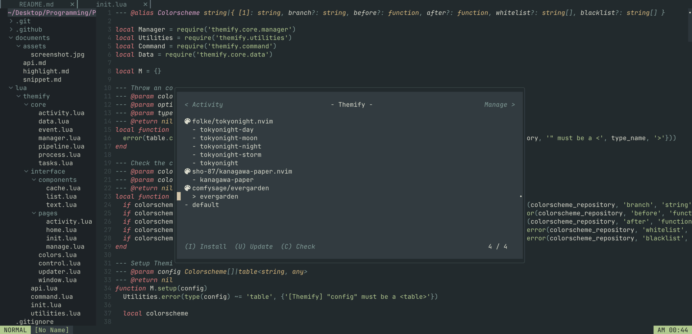

# Themify



A colorscheme manager and switcher designed for [Neovim](https://neovim.io) written in [Lua](https://www.lua.org). Inspired by [Themery.nvim](https://github.com/zaldih/themery.nvim) and [Lazy.nvim](https://github.com/folke/lazy.nvim).

- 🎨 Easily install and manage your colorschemes.
- 🔍 Explore and preview colorschemes directly in Neovim.
- ⚡️ Optimized startup time with lazy-loaded colorschemes.

## 📦 Installation

Use the package manager of your choice to install Theminify:

- [Lazy.nvim](https://github.com/folke/lazy.nvim)

```lua
{
  'lmantw/themify.nvim',
    
  lazy = false,
  priority = 999,

  config = {}
}
```

- [Packer.nvim](https://github.com/wbthomason/packer.nvim)

```lua
use {
  'lmantw/themify.nvim',

  config = {}
}
```

## 🛠 Configuration

The configuration for Themify is really easy and stright forward, just call the `setup` function (or use the `config` option in your package manager) and add the colorschemes you want to install / manage:

```lua
require("themery").setup({
  -- Your list of colorschemes.

  'folke/tokyonight.nvim',
  'Yazeed1s/minimal.nvim',
  {
'sho-87/kanagawa-paper.nvim',

    branch = 'master'
  },

  -- Built-in colorschemes are also supported.
  -- (Also works with any colorschemes that are installed via other plugin manager, just make sure the colorscheme is loaded before Themify is loaded.)
  'default'
})
```

> [!IMPORTANT]
> The colorschemes will not be installed automatically due to performance considerations. Please use the command `:Themify` to open the interface, then press `I` to install all the colorschemes.

<details>
  <summary>Advance Configuration</summary>

  ```lua
  {
    async = false,
    -- Enable this would load the colorscheme asynchronously, which might improve your startup time.

    {
      'folke/tokyonight.nvim',

      branch = 'main',

      before = function()
        -- The function run before the colorscheme is loaded.
      end,
      after = function()
        -- The function run after the colorscheme is loaded.
      end,

      -- A colorscheme can have multiple themes, you can use the options below to only show the themes you want.
      whitelist = {'tokyonight-night', 'tokyonight-day'},
      blacklist = {}
    }
  }
  ```
</details>

## 📚 Colorscheme Database

> [!NOTE]
> You can add a colorscheme to the database by [opening an issue]().

## 📎 Other

- [Highlight Groups](./documents/highlight.md)
- [API Documentation](./documents/api.md)

<a href="https://star-history.com/#LmanTW/themify.nvim&Date">
 <picture>
   <source media="(prefers-color-scheme: dark)" srcset="https://api.star-history.com/svg?repos=LmanTW/themify.nvim&type=Date&theme=dark" />
   <source media="(prefers-color-scheme: light)" srcset="https://api.star-history.com/svg?repos=LmanTW/themify.nvim&type=Date" />
   
 </picture>
</a>
